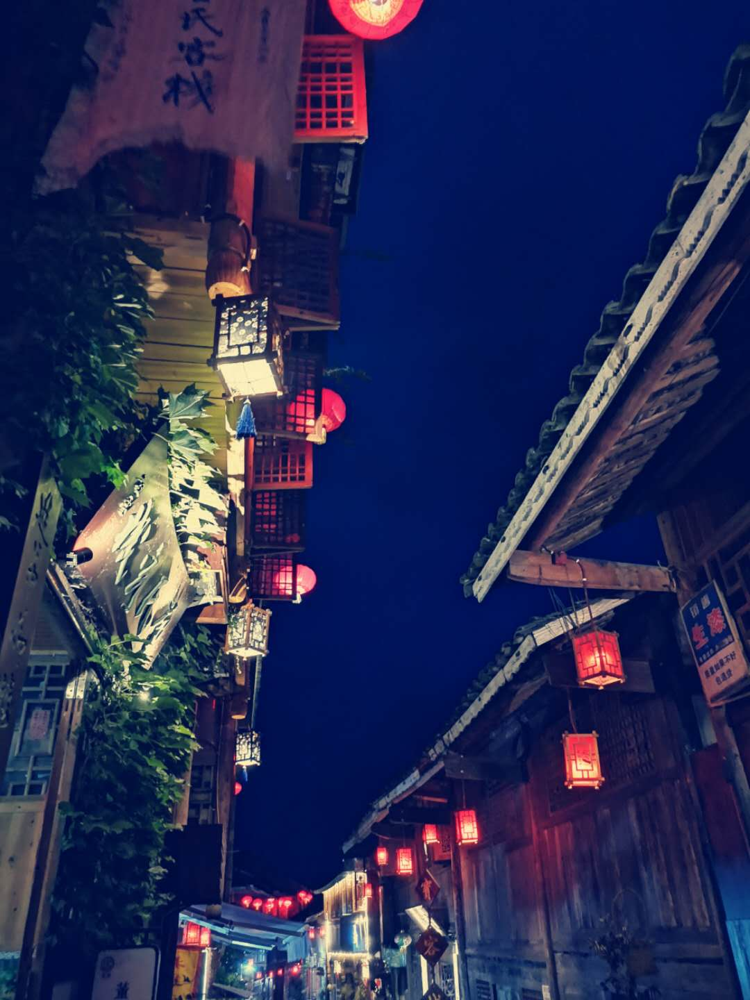

# 自我介绍

我叫小敏,是东北大学的一名研究生。

研究方向是：基于深度学习对医学组织病理学的图像处理。

研究生成果有两篇SCI：

1. [A Comprehensive Review for Breast Histopathology Image Analysis Using Classical and Deep Neural Networks](https://ieeexplore.ieee.org/document/9091012)
2. [An Application of Transfer Learning and Ensemble Learning Techniques for Cervical Histopathology Image Classification](https://ieeexplore.ieee.org/document/9107128)
   
我的爱好是:

1. 唱歌
2. 摄影
3. 打羽毛球
4. 打篮球

我最近读过的书有：

* 《了不起的我》
* 《人间值得》
* 《时光清浅，许你安然》

给你展示一下我的摄影作品吧:



这是代码

```javascript
var b = function(){
    alert("这里是代码块")；
}
b();
```